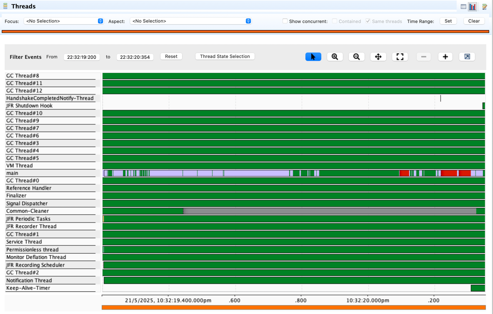
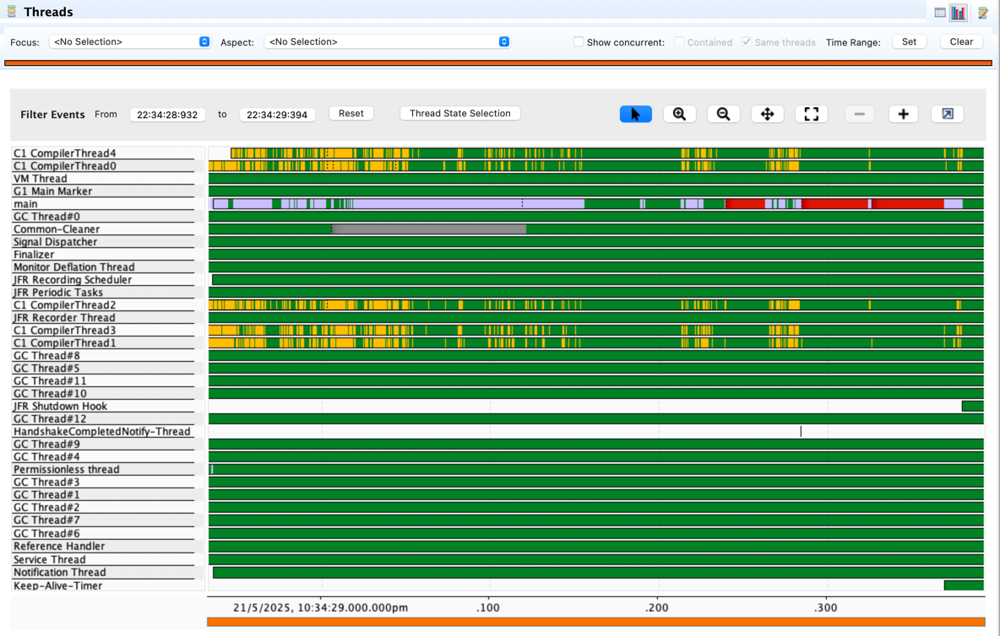

# Java Lambda Template
This repository provides a template for creating AWS Lambda functions using Java.

## Configuration
After experimenting, 2GB RAM seems like it produces optimal performance/price point for Java (at least an SDK lambda like this).

## Results
Best results for a cold Java lambda S3 upload so far are around ~2s.

There are 2 mysteries:
1. What is the AWS SDK doing during the 1s of SDK init time?
2. Why does the first upload take ~500ms compared with subsequent excellent ~25ms.

```Output
Test lambda ran successfully. Cold! Total time ~1995ms (s3 init time 1039ms, s3 upload time 506ms, approx lambda init 450ms)!
Test lambda ran successfully. Cold! Total time ~1961ms (s3 init time 1032ms, s3 upload time 479ms, approx lambda init 450ms)!
Test lambda ran successfully. Warm! Total time 24ms (3 prior invocations)!
```

```CloudWatch Logs
2025-05-21T03:29:26.330Z
INIT_START Runtime Version: java:21.v38 Runtime Version ARN: arn:aws:lambda:ap-southeast-2::runtime:81e4ff5669ca00936ae2ebcd7e3ee4b820d9f1dec101bbabbb706dc9e1481298
2025-05-21T03:29:27.829Z
START RequestId: 314220ad-40f4-4204-843c-713576ded59a Version: $LATEST
2025-05-21T03:29:28.374Z
END RequestId: 314220ad-40f4-4204-843c-713576ded59a
2025-05-21T03:29:28.374Z
REPORT RequestId: 314220ad-40f4-4204-843c-713576ded59a	Duration: 544.92 ms	Billed Duration: 545 ms	Memory Size: 2048 MB	Max Memory Used: 174 MB	Init Duration: 1494.57 ms	
```


### vCPU Comparison

In the documentation it states that Memory also controls CPU and Network I/O performance.
1769MB of memory is equivalent to 1 vCPU.
Presumably each 1769MB added adds 1 vCPU.

Using the Java URL Connection HTTP client, these are the cold start times for each:

1 vCPU (3,538MB RAM): - 2,482ms cold
```
2025-05-21T11:34:47.229Z
INIT_START Runtime Version: java:21.v38	Runtime Version ARN: arn:aws:lambda:ap-southeast-2::runtime:81e4ff5669ca00936ae2ebcd7e3ee4b820d9f1dec101bbabbb706dc9e1481298

INIT_START Runtime Version: java:21.v38 Runtime Version ARN: arn:aws:lambda:ap-southeast-2::runtime:81e4ff5669ca00936ae2ebcd7e3ee4b820d9f1dec101bbabbb706dc9e1481298
2025-05-21T11:34:48.858Z
START RequestId: af002f9d-e45e-4c26-b93c-274c4666704f Version: $LATEST
2025-05-21T11:34:49.714Z
END RequestId: af002f9d-e45e-4c26-b93c-274c4666704f
2025-05-21T11:34:49.714Z
REPORT RequestId: af002f9d-e45e-4c26-b93c-274c4666704f Duration: 856.05 ms Billed Duration: 857 ms Memory Size: 1769 MB Max Memory Used: 175 MB Init Duration: 1625.58 ms

Output: Test lambda ran successfully. Cold! Total time ~2393ms (s3 init time 1121ms, s3 upload time 822ms, approx lambda init 450ms)!


```
(retried and similar outcome for subsequent run - performance is consistent)

2 vCPUs (3,538MB RAM): - 1,982ms
```
2025-05-21T11:40:34.144Z
INIT_START Runtime Version: java:21.v38 Runtime Version ARN: arn:aws:lambda:ap-southeast-2::runtime:81e4ff5669ca00936ae2ebcd7e3ee4b820d9f1dec101bbabbb706dc9e1481298
2025-05-21T11:40:35.425Z
START RequestId: 9c6b4288-b468-46c1-8358-aae174c88784 Version: $LATEST
2025-05-21T11:40:36.130Z
END RequestId: 9c6b4288-b468-46c1-8358-aae174c88784
2025-05-21T11:40:36.130Z
REPORT RequestId: 9c6b4288-b468-46c1-8358-aae174c88784 Duration: 705.04 ms Billed Duration: 706 ms Memory Size: 3538 MB Max Memory Used: 184 MB Init Duration: 1277.16 ms

Output: Test lambda ran successfully. Cold! Total time ~2021ms (s3 init time 896ms, s3 upload time 675ms, approx lambda init 450ms)!
```

3 vCPUs (5,307MB RAM) - 2,087ms
```
2025-05-21T11:46:50.316Z
INIT_START Runtime Version: java:21.v38 Runtime Version ARN: arn:aws:lambda:ap-southeast-2::runtime:81e4ff5669ca00936ae2ebcd7e3ee4b820d9f1dec101bbabbb706dc9e1481298
2025-05-21T11:46:51.680Z
START RequestId: fd25d18e-9c5a-438f-a2a7-1ce5a15136e2 Version: $LATEST
2025-05-21T11:46:52.408Z
END RequestId: fd25d18e-9c5a-438f-a2a7-1ce5a15136e2
2025-05-21T11:46:52.408Z
REPORT RequestId: fd25d18e-9c5a-438f-a2a7-1ce5a15136e2 Duration: 727.44 ms Billed Duration: 728 ms Memory Size: 5307 MB Max Memory Used: 184 MB Init Duration: 1360.83 ms


Output: Test lambda ran successfully. Cold! Total time ~2057ms (s3 init time 912ms, s3 upload time 695ms, approx lambda init 450ms)!
```
(essentially no improvement)

4 vCPUs (7,076MB RAM) - 2,028ms
```
2025-05-21T11:59:28.531Z
INIT_START Runtime Version: java:21.v38 Runtime Version ARN: arn:aws:lambda:ap-southeast-2::runtime:81e4ff5669ca00936ae2ebcd7e3ee4b820d9f1dec101bbabbb706dc9e1481298
2025-05-21T11:59:29.851Z
START RequestId: 3c9e24fe-bb0c-4805-8312-9d93b0f4496d Version: $LATEST
2025-05-21T11:59:30.564Z
END RequestId: 3c9e24fe-bb0c-4805-8312-9d93b0f4496d
2025-05-21T11:59:30.564Z
REPORT RequestId: 3c9e24fe-bb0c-4805-8312-9d93b0f4496d Duration: 712.67 ms Billed Duration: 713 ms Memory Size: 7076 MB Max Memory Used: 193 MB Init Duration: 1316.33 ms


Output: Test lambda ran successfully. Cold! Total time ~2054ms (s3 init time 921ms, s3 upload time 683ms, approx lambda init 450ms)!
```
(no improvement)

### Parallelism in Lambda Java
Here's a snapshot of the threads running locally when running my lambda function:


Timing:
```
 1.87s user 0.33s system 328% cpu 0.670 total
```

I wonder if the multiple vCPUs enhanced performance (up to 2 vCPUs) is related to
the threads.

Here's the same thread picture with the following environment variable (turning compilation off, running as interpreter only):
```JAVA_TOOL_OPTIONS="-XX:+TieredCompilation -XX:TieredStopAtLevel=0"```


Timing:
```
 1.30s user 0.05s system 92% cpu 1.462 total
```

And with stop at 1:
```JAVA_TOOL_OPTIONS="-XX:+TieredCompilation -XX:TieredStopAtLevel=1"```


Timing:
```
 0.64s user 0.08s system 123% cpu 0.586 total
```

Conclusion: The fewer vCPUs we have, the more cost perhaps is incurred by the parallelism inherent
to the Java ecosystem and its compilation threads.

These are the numbers with tiered compilation 1, 2 vCPU:s 2,004ms cold start
```
2025-05-21T12:47:13.165Z
INIT_START Runtime Version: java:21.v38 Runtime Version ARN: arn:aws:lambda:ap-southeast-2::runtime:81e4ff5669ca00936ae2ebcd7e3ee4b820d9f1dec101bbabbb706dc9e1481298
2025-05-21T12:47:13.187Z
Picked up JAVA_TOOL_OPTIONS: -XX:+TieredCompilation -XX:TieredStopAtLevel=1
2025-05-21T12:47:14.461Z
START RequestId: fe6c7c5c-9e3a-4a7d-95c2-4e404051f754 Version: $LATEST
2025-05-21T12:47:15.174Z
END RequestId: fe6c7c5c-9e3a-4a7d-95c2-4e404051f754
2025-05-21T12:47:15.174Z
REPORT RequestId: fe6c7c5c-9e3a-4a7d-95c2-4e404051f754 Duration: 712.55 ms Billed Duration: 713 ms Memory Size: 3538 MB Max Memory Used: 184 MB Init Duration: 1292.41 ms


Output: Test lambda ran successfully. Cold! Total time ~2034ms (s3 init time 903ms, s3 upload time 681ms, approx lambda init 450ms)!
```

(compilation 0 was awful when deployed)

Maybe 1vcpu will be as efficient?
A: No, still slower. Trying 2gbs.