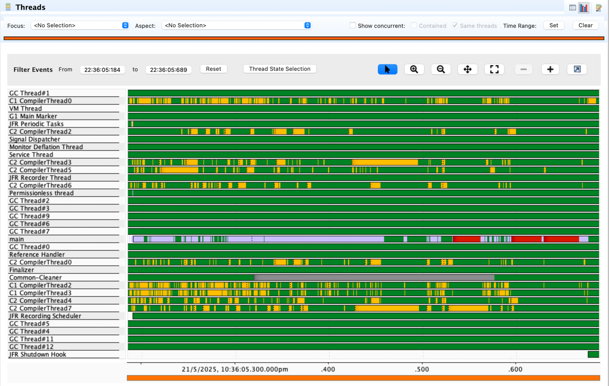

# Java Lambda Template
This repository provides a template for creating AWS Lambda functions using Java.  
Please fork, experiment and send PRs / issues if you have an interest in improving it.

## Experiments
The below are my notes prior to the [conclusions](#conclusions) at the bottom of the readme.

### Initial Results (pre-optimisations)
Best results for a cold Java lambda S3 upload before the following experiments was ~2.5s.  
(with the default 1GB RAM using Serverless and the AWS SDK maven dependencies with no tweaking)

Increasing to 2GB of RAM brought it down to 2s, but no amount of RAM above that would help (see below).

There were 2 mysteries:
1. What is the AWS SDK doing during the ~1s of SDK init time?
2. Why does the first upload take ~500ms compared with subsequent excellent ~25ms.

... and how can we overcome that?

```Output
Test lambda ran successfully. Cold! Total time ~1995ms (s3 init time 1039ms, s3 upload time 506ms, approx lambda init 450ms)!
Test lambda ran successfully. Cold! Total time ~1961ms (s3 init time 1032ms, s3 upload time 479ms, approx lambda init 450ms)!
Test lambda ran successfully. Warm! Total time 24ms (3 prior invocations)!
```

```CloudWatch Logs
2025-05-21T03:29:26.330Z
INIT_START Runtime Version: java:21.v38 Runtime Version ARN: arn:aws:lambda:ap-southeast-2::runtime:81e4ff5669ca00936ae2ebcd7e3ee4b820d9f1dec101bbabbb706dc9e1481298
2025-05-21T03:29:27.829Z
START RequestId: 314220ad-40f4-4204-843c-713576ded59a Version: $LATEST
2025-05-21T03:29:28.374Z
END RequestId: 314220ad-40f4-4204-843c-713576ded59a
2025-05-21T03:29:28.374Z
REPORT RequestId: 314220ad-40f4-4204-843c-713576ded59a	Duration: 544.92 ms	Billed Duration: 545 ms	Memory Size: 2048 MB	Max Memory Used: 174 MB	Init Duration: 1494.57 ms	
```


### vCPU Comparison
In the documentation it states that Memory also controls CPU and Network I/O performance.
1769MB of memory is equivalent to 1 vCPU.
Presumably each 1769MB added adds 1 vCPU.

Using the Java URL Connection HTTP client, these are the cold start times for each:

1 vCPU (1769M RAM): - 2,482ms cold
```
2025-05-21T11:34:47.229Z
INIT_START Runtime Version: java:21.v38	Runtime Version ARN: arn:aws:lambda:ap-southeast-2::runtime:81e4ff5669ca00936ae2ebcd7e3ee4b820d9f1dec101bbabbb706dc9e1481298

INIT_START Runtime Version: java:21.v38 Runtime Version ARN: arn:aws:lambda:ap-southeast-2::runtime:81e4ff5669ca00936ae2ebcd7e3ee4b820d9f1dec101bbabbb706dc9e1481298
2025-05-21T11:34:48.858Z
START RequestId: af002f9d-e45e-4c26-b93c-274c4666704f Version: $LATEST
2025-05-21T11:34:49.714Z
END RequestId: af002f9d-e45e-4c26-b93c-274c4666704f
2025-05-21T11:34:49.714Z
REPORT RequestId: af002f9d-e45e-4c26-b93c-274c4666704f Duration: 856.05 ms Billed Duration: 857 ms Memory Size: 1769 MB Max Memory Used: 175 MB Init Duration: 1625.58 ms

Output: Test lambda ran successfully. Cold! Total time ~2393ms (s3 init time 1121ms, s3 upload time 822ms, approx lambda init 450ms)!


```
(retried and similar outcome for subsequent run - performance is consistent)

2 vCPUs (3,538MB RAM): - 1,982ms
```
2025-05-21T11:40:34.144Z
INIT_START Runtime Version: java:21.v38 Runtime Version ARN: arn:aws:lambda:ap-southeast-2::runtime:81e4ff5669ca00936ae2ebcd7e3ee4b820d9f1dec101bbabbb706dc9e1481298
2025-05-21T11:40:35.425Z
START RequestId: 9c6b4288-b468-46c1-8358-aae174c88784 Version: $LATEST
2025-05-21T11:40:36.130Z
END RequestId: 9c6b4288-b468-46c1-8358-aae174c88784
2025-05-21T11:40:36.130Z
REPORT RequestId: 9c6b4288-b468-46c1-8358-aae174c88784 Duration: 705.04 ms Billed Duration: 706 ms Memory Size: 3538 MB Max Memory Used: 184 MB Init Duration: 1277.16 ms

Output: Test lambda ran successfully. Cold! Total time ~2021ms (s3 init time 896ms, s3 upload time 675ms, approx lambda init 450ms)!
```

3 vCPUs (5,307MB RAM) - 2,087ms
```
2025-05-21T11:46:50.316Z
INIT_START Runtime Version: java:21.v38 Runtime Version ARN: arn:aws:lambda:ap-southeast-2::runtime:81e4ff5669ca00936ae2ebcd7e3ee4b820d9f1dec101bbabbb706dc9e1481298
2025-05-21T11:46:51.680Z
START RequestId: fd25d18e-9c5a-438f-a2a7-1ce5a15136e2 Version: $LATEST
2025-05-21T11:46:52.408Z
END RequestId: fd25d18e-9c5a-438f-a2a7-1ce5a15136e2
2025-05-21T11:46:52.408Z
REPORT RequestId: fd25d18e-9c5a-438f-a2a7-1ce5a15136e2 Duration: 727.44 ms Billed Duration: 728 ms Memory Size: 5307 MB Max Memory Used: 184 MB Init Duration: 1360.83 ms


Output: Test lambda ran successfully. Cold! Total time ~2057ms (s3 init time 912ms, s3 upload time 695ms, approx lambda init 450ms)!
```
(essentially no improvement)

4 vCPUs (7,076MB RAM) - 2,028ms
```
2025-05-21T11:59:28.531Z
INIT_START Runtime Version: java:21.v38 Runtime Version ARN: arn:aws:lambda:ap-southeast-2::runtime:81e4ff5669ca00936ae2ebcd7e3ee4b820d9f1dec101bbabbb706dc9e1481298
2025-05-21T11:59:29.851Z
START RequestId: 3c9e24fe-bb0c-4805-8312-9d93b0f4496d Version: $LATEST
2025-05-21T11:59:30.564Z
END RequestId: 3c9e24fe-bb0c-4805-8312-9d93b0f4496d
2025-05-21T11:59:30.564Z
REPORT RequestId: 3c9e24fe-bb0c-4805-8312-9d93b0f4496d Duration: 712.67 ms Billed Duration: 713 ms Memory Size: 7076 MB Max Memory Used: 193 MB Init Duration: 1316.33 ms


Output: Test lambda ran successfully. Cold! Total time ~2054ms (s3 init time 921ms, s3 upload time 683ms, approx lambda init 450ms)!
```
(no improvement)

### Parallelism in Lambda Java + Tiered Compilation
Using the script:
```bash
./local-runner-profile.sh
```

I ran the lambda locally using Java Flight Recorder (JFR) and visualised the results with JDK Mission Control (JMC),
using high-intensity profiler settings (because the execution is so short). 

Here's a snapshot of the threads running locally when running my lambda function:


Timing:
```
 1.87s user 0.33s system 328% cpu 0.670 total
```
Interesting to note the longer user time than real time - this is high multithreading concurrency. 

I wonder if the multiple vCPUs enhanced performance (up to 2 vCPUs) is related to
the threads.

Here's the same thread picture with the following environment variable (turning compilation off, running as interpreter only):
```JAVA_TOOL_OPTIONS="-XX:+TieredCompilation -XX:TieredStopAtLevel=0"```


Timing:
```
 1.30s user 0.05s system 92% cpu 1.462 total
```
Much slower!

And with stop at 1:
```JAVA_TOOL_OPTIONS="-XX:+TieredCompilation -XX:TieredStopAtLevel=1"```


Timing:
```
 0.64s user 0.08s system 123% cpu 0.586 total
```
Faster overall, and with not too much concurrency.

Conclusion: The fewer vCPUs we have, the more cost perhaps is incurred by the parallelism inherent
to the Java ecosystem and its compilation threads.

These are the numbers as a deployed lambda with tiered compilation set in the JAVA_TOOL_OPTIONS environment variable (tier 1)  
2 vCPU:s 2,004ms cold start
```
2025-05-21T12:47:13.165Z
INIT_START Runtime Version: java:21.v38 Runtime Version ARN: arn:aws:lambda:ap-southeast-2::runtime:81e4ff5669ca00936ae2ebcd7e3ee4b820d9f1dec101bbabbb706dc9e1481298
2025-05-21T12:47:13.187Z
Picked up JAVA_TOOL_OPTIONS: -XX:+TieredCompilation -XX:TieredStopAtLevel=1
2025-05-21T12:47:14.461Z
START RequestId: fe6c7c5c-9e3a-4a7d-95c2-4e404051f754 Version: $LATEST
2025-05-21T12:47:15.174Z
END RequestId: fe6c7c5c-9e3a-4a7d-95c2-4e404051f754
2025-05-21T12:47:15.174Z
REPORT RequestId: fe6c7c5c-9e3a-4a7d-95c2-4e404051f754 Duration: 712.55 ms Billed Duration: 713 ms Memory Size: 3538 MB Max Memory Used: 184 MB Init Duration: 1292.41 ms


Output: Test lambda ran successfully. Cold! Total time ~2034ms (s3 init time 903ms, s3 upload time 681ms, approx lambda init 450ms)!
```

(compilation 0 was awful when deployed)

Maybe 1vcpu will be as efficient?
A: No, still slower. Trying 2gbs.

2gbs was still slower. Back to 2 vCPUs, keeping the tiered compilation option perhaps it has a minor effect.

Summary: saw highly concurrent compilations when profiling using Java Flight Recorder and visualising with JDK Mission Control (jmc), tier 1 seems a good balance and tier 0 (interpretation only) was terrible).
Locally I can see this reducing the time for start and execution by ~120ms. There may be ongoing compilation optimisations
possible which we are missing out on, however especially if we are using CRT HTTP client, these are likely to be minor.

### SnapStart (with primer)
I previously tried SnapStart and found no real benefits for this use-case.  

However reading this:
https://dev.to/aws-builders/aws-snapstart-part-26-measuring-cold-and-warm-starts-with-java-21-using-different-garbage-collection-algorithms-8h3

Got me on to the idea of 'priming' the lambda during the SnapStart process before the image is taken.  

This refers to performing an actual invocation—fully exercising the SDK code before the snapshot is taken.

I've now done so. The results are pretty awesome:

``` 2 vCPUs (3,538MB RAM), SnapStart Enabled, Tiered Compilation (stop at level 1), Prime Lambda: - 938ms
2025-05-21T14:26:55.893Z
RESTORE_START Runtime Version: java:21.v38 Runtime Version ARN: arn:aws:lambda:ap-southeast-2::runtime:81e4ff5669ca00936ae2ebcd7e3ee4b820d9f1dec101bbabbb706dc9e1481298
2025-05-21T14:26:56.655Z
Restored SnapStart snapshot.
2025-05-21T14:26:56.661Z
RESTORE_REPORT Restore Duration: 789.64 ms
2025-05-21T14:26:56.665Z
START RequestId: 5b321b10-9dfa-4a05-b900-c45b96303238 Version: 23
2025-05-21T14:26:56.814Z
END RequestId: 5b321b10-9dfa-4a05-b900-c45b96303238
2025-05-21T14:26:56.814Z
REPORT RequestId: 5b321b10-9dfa-4a05-b900-c45b96303238	Duration: 149.53 ms	Billed Duration: 313 ms	Memory Size: 3538 MB	Max Memory Used: 163 MB	Restore Duration: 789.64 ms	Billed Restore Duration: 163 ms	

REPORT RequestId: 5b321b10-9dfa-4a05-b900-c45b96303238 Duration: 149.53 ms Billed Duration: 313 ms Memory Size: 3538 MB Max Memory Used: 163 MB Restore Duration: 789.64 ms Billed Restore Duration: 163 ms

Output: 
Test lambda ran successfully. Cold! Total time ~877ms (s3 init time 0ms, s3 upload time 77ms, approx lambda SnapStart restore 800ms)!
..
Test lambda ran successfully. Warm! Total time 26ms (3 prior invocations)!
```

If this is consistent this performance is really good enough for me.

One fear I have is that the connection 'primed' in the CRaC phase, may have become stale.

If so, we may have additional cold start time with errors and retries as a result. Will try cold run tomorrow to confirm.

Next day (9 hours later), confirmed cold starts are still subsecond: - 520ms cold start!
```
2025-05-22T00:33:09.921Z
RESTORE_START Runtime Version: java:21.v38 Runtime Version ARN: arn:aws:lambda:ap-southeast-2::runtime:81e4ff5669ca00936ae2ebcd7e3ee4b820d9f1dec101bbabbb706dc9e1481298
2025-05-22T00:33:10.321Z
Restored SnapStart snapshot.
2025-05-22T00:33:10.325Z
RESTORE_REPORT Restore Duration: 422.92 ms
2025-05-22T00:33:10.329Z
START RequestId: dfdd669e-d1d5-48a7-9fbf-9247b567555a Version: 25
2025-05-22T00:33:10.428Z
END RequestId: dfdd669e-d1d5-48a7-9fbf-9247b567555a
2025-05-22T00:33:10.428Z
REPORT RequestId: dfdd669e-d1d5-48a7-9fbf-9247b567555a Duration: 98.35 ms Billed Duration: 175 ms Memory Size: 3538 MB Max Memory Used: 157 MB Restore Duration: 422.92 ms Billed Restore Duration: 76 ms

Output: Test lambda ran successfully. Cold! Total time ~868ms (s3 init time 0ms, s3 upload time 68ms, approx lambda SnapStart restore 800ms)!
(wrong total because the assumed init time was actually only 422ms not 800ms)

```

#### The CRT HTTP client
After reading some more about the CRT client there are some strong claims about its performance and reliability:

> The AWS CRT-based HTTP clients provide the following HTTP client benefits:
> - Faster SDK startup time
> - Smaller memory footprint
> - Reduced latency time
> - Connection health management
> - DNS load balancing  

Ref: https://docs.aws.amazon.com/sdk-for-java/latest/developer-guide/http-configuration-crt.html

After testing snapstart performance with the CRT client it's apparent that 
there is no degradation from the HTTP URL Connection, and even though there are 
significant downsides:
- increased bundle size ~2.3MB larger at 11MB
- much more complex dependencies (profiles, pom exclusions)
- inscrutable code - written in C with JNI bindings

I think that the fact this is the recommended client and that it seems
to have more maintenance activity than the other HTTP clients on GitHub
is enough to warrant using it.


## Conclusions
I think I've hit on the best performing blend of configurations for a Java 21 lambda using the S3 AWS SDK:
1. Use the recommended CRT HTTP client, with a profile to bundle only the architecture specific binary  
   https://docs.aws.amazon.com/sdk-for-java/latest/developer-guide/lambda-optimize-starttime.html#lambda-quick-url  
   https://docs.aws.amazon.com/sdk-for-java/latest/developer-guide/http-configuration-crt.html
   This adds significant complexity to the POM but is probably worthwhile for runtime performance gains touted.
2. Use tiered compilation (level 1) to limit concurrency of the compiler (optional)
   JAVA_TOOL_OPTIONS: "-XX:+TieredCompilation -XX:TieredStopAtLevel=1"
   https://docs.aws.amazon.com/lambda/latest/dg/java-customization.html
3. Use the default G1 garbage collector  
   https://dev.to/aws-builders/aws-snapstart-part-26-measuring-cold-and-warm-starts-with-java-21-using-different-garbage-collection-algorithms-8h3
   (it would be interesting to see if we could get newer GC settings with JDK 21 working and whether this would improve things)
4. Use 2 vCPUs (3,538MB RAM) to allow the JVM some concurrency and a little CPU + RAM breathing room  
   memorySize: 3538 # 2 vCPUs
   https://docs.aws.amazon.com/lambda/latest/dg/configuration-memory.html
   (see above timings)
5. Use SnapStart, and fully exercise (prime) the SDK (including running an upload) before the snapshot is taken
   https://docs.aws.amazon.com/lambda/latest/dg/snapstart.html  
   https://dev.to/aws-builders/measuring-java-11-lambda-cold-starts-with-snapstart-part-5-priming-end-to-end-latency-and-deployment-time-jem  
   https://aws.amazon.com/blogs/compute/reducing-java-cold-starts-on-aws-lambda-functions-with-snapstart/
```
   @Override
   public void beforeCheckpoint(org.crac.Context<? extends Resource> context) {
       //Prime the lambda by running a handler event to upload to S3
       logger.info("Priming lambda by running a handler event to upload to S3.");
       EntryPoint entryPoint = new EntryPoint();
       entryPoint.handleRequest(new ApplicationLoadBalancerRequestEvent(), null);
       logger.info("Finished priming lambda by running a handler event to upload to S3.");
   }
   @Override
   public void afterRestore(org.crac.Context<? extends Resource> context) {
   }
```

Following all these for a lambda which uploads a 5 byte object, I'm regularly seeing:
~500ms cold start
~25ms warm

End to end HTTP request latency behind an API gateway, from my home in Sydney to the ap-southeast-2 region:
600-700ms cold start
50-80ms warm

## Why?
You might be thinking that there is a lot of complexity in configuring all this, and you'd be right. 

The AWS SDK is clearly built with a lot of fat, multiple configurations and is very inefficient at load time.

At runtime, it is very performant and works well. This speaks to the goals of the team maintaining it and the
typical uses in long-running containerised Java processes. 

For all that, with a few tweaks as described here Java can be an excellent lambda language with the following being some
benefits:
1. Re-use of existing Java libraries and code (esp for companies using Java already for long-running services, needing
   additional supporting serverless functions)
2. Excellence in testing and consistency, with libraries like JUnit and associated ecosystem
3. High performance compiled code (compared with Python and NodeJS interpreted / semi-compiled languages)
4. Strict typing, which is especially useful dealing with semistructured and unstructured inputs for consistency and validation of events
5. Easy local debugging - for example in this project I have a little web server I am running for testing LocalRunner. I 
   envision sharing this kind of local debugging code across a little fleet of lambdas using maven modules. 

All in all I was pretty pleased to get to this result and it restored (some) of my faith in the possibility of using 
Java for lambdas.